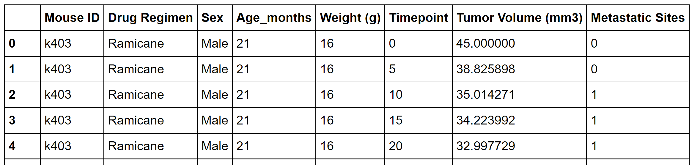
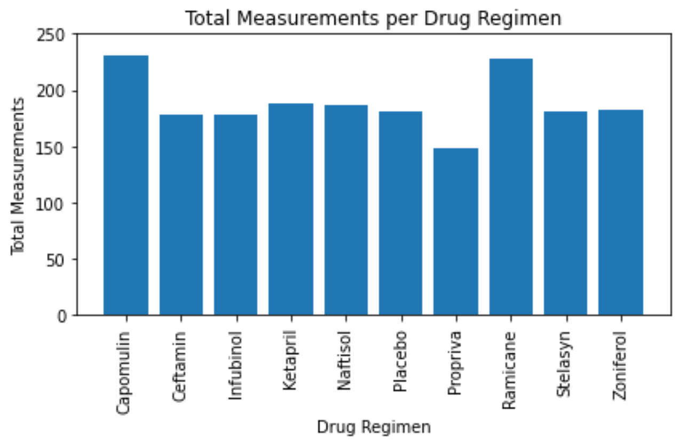
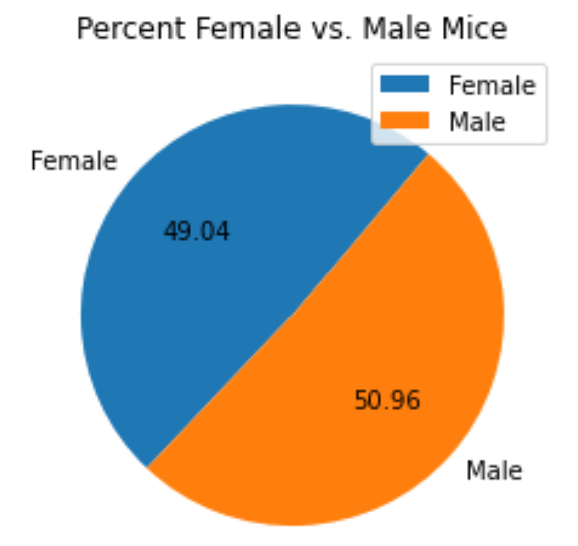
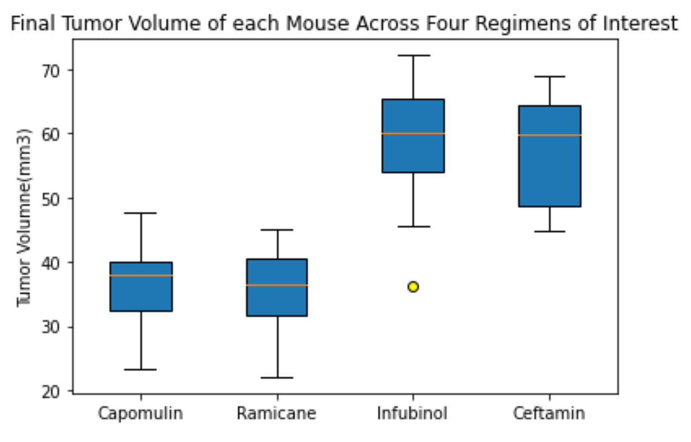
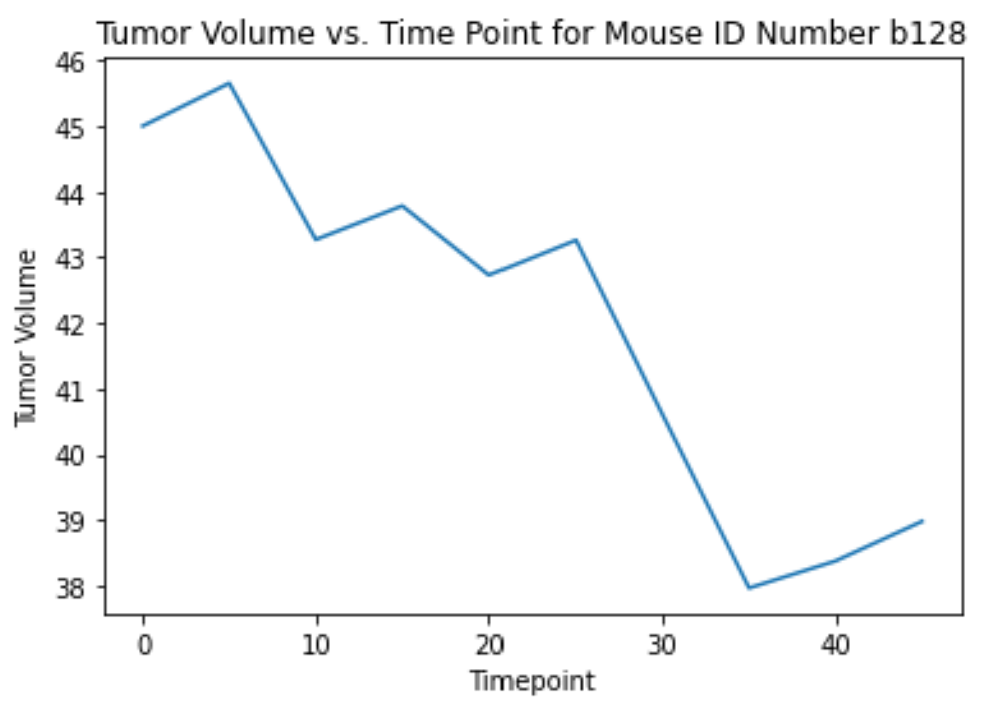
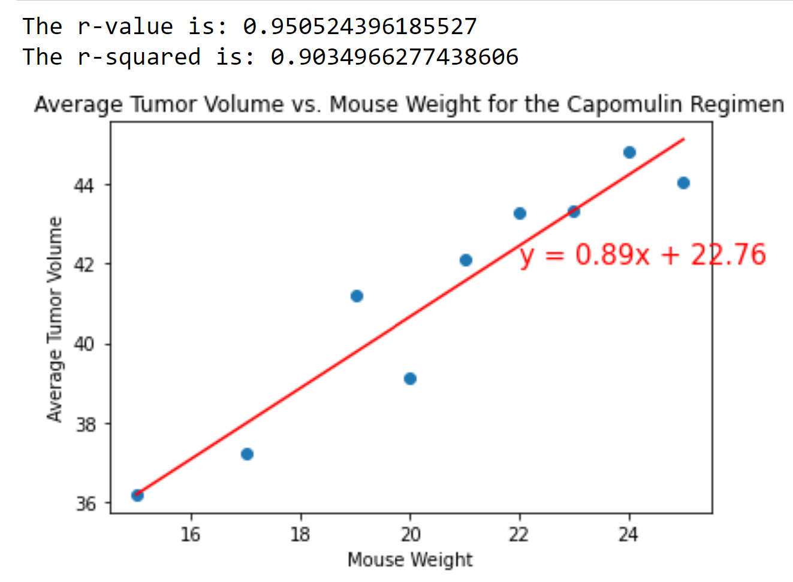

# Matplotlib Mice

Python Matplotlib applied to a hypothetical real-world situation and dataset.

## Situation

In a scientific animal study, 249 mice identified with squamous cell carcinoma (SCC) tumor growth were treated through a variety of drug regimens. Over the course of 45 days, tumor development was observed and measured. The purpose of this study was to compare the performance of Capomulin, versus the other treatment regimens. The task is to generate all of the tables and figures needed for the technical report of the study.

## Lab Rats at Work

## Steps

- Check the data for any mouse ID with duplicate time points and remove any data associated with that mouse ID.
- Generate a summary statistics table consisting of the mean, median, variance, standard deviation, and SEM of the tumor volume for each drug regimen.
- Generate a [bar plot](Images/drug_bar.png) using both Pandas and Matplotlib's pyplot that shows the total number of measurements taken for each treatment regimen throughout the course of the study.
- Generate a [pie plot](Images/male_female_pie.png) using both Pandas’ and Matplotlib's pyplot that shows the distribution of female or male mice in the study.
- Calculate the final tumor volume of each mouse across four of the most promising treatment regimens: Capomulin, Ramicane, Infubinol, and Ceftamin. Calculate the quartiles and IQR and quantitatively determine if there are any potential outliers across all four treatment regimens.
- Using Matplotlib, generate a [box and whisker plot](Images/boxplot_mouse.png) of the final tumor volume for all four treatment regimens and highlight any potential outliers in the plot by changing their color and style.
- Select a mouse that was treated with Capomulin and generate a [line plot](Images/volume_line.png) of tumor volume vs. time point for that mouse.
- Generate a scatter plot of tumor volume versus mouse weight for the Capomulin treatment regimen.
- Calculate the correlation coefficient and [linear regression model](Images/linear_regression.png) between mouse weight and average tumor volume for the Capomulin treatment. Plot the linear regression model on top of the previous scatter plot.
- Look across all previously generated figures and tables and write at least three observations or inferences that can be made from the data. Include these observations at the top of notebook.

## Results

 

 | 
:-------------------------:|:-------------------------:

 | 
:-------------------------:|:-------------------------:

## Data Source

- [Mockaroo](https://www.mockaroo.com/)

## Resources

## Authors

- **David W. Mueller**
  - [LinkedIn Profile](https://www.linkedin.com/in/davidwaltermueller/)
  - davemuelle@gmail.com

## Acknowledgments

- Michigan State University Data Analytics Bootcamp; April 23, 2021.

## References

Mockaroo, LLC. (2021). Realistic Data Generator. <https://www.mockaroo.com/>
